# EGR 560 Project: Baseline Path Tracking and Simulink Implementation

This workspace contains a discrete-time path-tracking study for a ground vehicle using a linear bicycle model, LQR feedback, steering-actuator limits, and a novelty-style residual estimator for model-mismatch detection. The repository includes both a MATLAB script workflow for analysis and plotting, and a Simulink implementation for block-diagram simulation and presentation.

## Project Overview

The baseline controller is built around the lateral tracking state

\[
x = \begin{bmatrix} e_y & e_\psi & v_y & r \end{bmatrix}^T
\]

where:

- `e_y` is lateral path-tracking error
- `e_psi` is heading error
- `v_y` is lateral velocity
- `r` is yaw rate

The reference input is road curvature `kappa_ref`, generated for two scenarios:

- Lane-change curvature burst
- Constant-radius turn

The steering law used throughout the project is:

\[
\delta_{cmd} = (l_f + l_r)\kappa_{ref} - Kx
\]

where the first term is feedforward steering based on path curvature and the second term is LQR state feedback.

## What Is Implemented

The current MATLAB baseline in `src/main_baseline.m` covers the following progression:

1. Continuous-time linear bicycle tracking model construction
2. Zero-order-hold discretization with sample time `Ts = 0.02 s`
3. Reference-curvature generation for lane-change and constant-turn scenarios
4. Open-loop response evaluation
5. Discrete LQR controller design and closed-loop tracking simulation
6. Steering actuator realism through rate limiting and angle saturation
7. Parameter-uncertainty tests using a perturbed plant with the same nominal controller
8. Crosswind disturbance injection through a lateral-force disturbance channel
9. Online residual and rolling worst-case bound estimation for novelty detection

The resulting workflow supports both controller-performance evaluation and a transition toward adaptive or robust control ideas in later phases.

## Simulink Model Overview

The Simulink model implements a discrete-time closed-loop path-tracking architecture based on the same linear bicycle tracking model used in MATLAB, with state

\[
x = \begin{bmatrix} e_y & e_\psi & v_y & r \end{bmatrix}^T.
\]

Its main subsystems are:

- Scenario generator: provides `kappa_ref` for the lane-change curvature burst and constant-radius turn cases
- Controller: computes LQR state feedback plus feedforward steering using `delta_cmd = (l_f + l_r)kappa_ref - Kx`
- Actuator block: applies realistic steering dynamics through rate limiting and angle saturation to produce `delta_applied`
- Plant block: propagates the discrete tracking model using the applied steering and curvature input
- Novelty estimator: computes the residual `w_hat`, its infinity norm `w_inf`, and a rolling maximum `w_max`

These signals are intended to indicate model mismatch, uncertainty, or external disturbance effects.

Closing summary for slides:

The Simulink implementation mirrors the MATLAB pipeline and supports both control performance evaluation and visual demonstration.

Available Simulink figure:

- `plots/simulink_model.pdf`: exported overview of the Simulink model layout for documentation and slides

## MATLAB Script Workflow

The main script is:

- `src/main_baseline.m`

This script builds the model, runs the scenarios, computes tracking metrics, and exports figures to `plots/`.

### Step-by-step content in `main_baseline.m`

- Step 1: builds the continuous and discrete tracking model from vehicle parameters
- Step 2: generates reference curvature and evaluates open-loop tracking error
- Step 3: designs the LQR baseline controller and evaluates closed-loop tracking
- Step 4: applies steering saturation and rate-limit constraints
- Step 5A: studies plant uncertainty by reducing tire cornering stiffness and optionally perturbing inertia terms
- Step 5B: injects a crosswind-like lateral disturbance pulse
- Step 6: computes residual-based novelty signals `w_hat`, `w_inf`, and `w_max`

The script exports a matching set of figures for each major step, so the numerical workflow in MATLAB is directly tied to the documentation images stored in `plots/`.

### Vehicle and control assumptions

The nominal parameters currently used in the script are:

- `m = 1573 kg`
- `Iz = 2031.4 kg-m^2`
- `lf = 1.04 m`
- `lr = 1.56 m`
- `Cf = 52618 N/rad`
- `Cr = 110185 N/rad`
- `Vx = 10 m/s`
- `Ts = 0.02 s`

The LQR weighting matrices are:

- `Q = diag([1000, 300, 5, 5])`
- `R = 1`

The default actuator limits are:

- `delta_max = 0.5 rad`
- `delta_rate_max = 0.5 rad/s`

## Scenario Definitions

Two reference-curvature cases are implemented:

- Lane change: a smooth raised-cosine curvature burst generated by `utils/generate_lane_change_kappa.m`
- Constant turn: a piecewise-constant curvature input generated by `utils/generate_constant_turn_kappa.m`

These cases are reused across open-loop, closed-loop, constrained, uncertainty, wind, and novelty-estimation studies so the behavior can be compared on a common basis.

Open-loop figures generated from these scenarios:

- `plots/scenario_A_lane_change.png`
- `plots/scenario_B_constant_turn.png`

## Novelty / Residual Estimation

The novelty-oriented estimator compares the measured next state against the nominal one-step predictor:

\[
\hat{w}(k) = x(k+1) - \left(A_d x_{meas}(k) + B_d \delta_{applied}(k) + E_d \kappa_{ref}(k)\right)
\]

From this residual, the code computes:

- `w_hat`: vector residual at each sample
- `w_inf`: infinity norm of the residual
- `w_max`: rolling maximum of `w_inf` over a finite window

In the current workspace, these signals are used to distinguish nominal behavior from:

- Plant uncertainty
- Wind disturbance

This provides a simple baseline mechanism for detecting mismatch before moving to adaptive tube sizing or more advanced robust control logic.

Novelty-estimation figures:

- `plots/scenario_B_what_overlay.png`
- `plots/scenario_B_wmax_overlay.png`

## Current Baseline Metrics

The following values come from the latest execution of `src/main_baseline.m` on March 24, 2026.

### Nominal LQR tracking

Lane change:

- `RMS(e_y) = 0.0017 m`
- `Max|e_y| = 0.0039 m`
- `Max|delta_cmd| = 0.0766 rad` (`4.4 deg`)

Constant turn:

- `RMS(e_y) = 0.0014 m`
- `Max|e_y| = 0.0020 m`
- `Max|delta_cmd| = 0.0394 rad` (`2.3 deg`)

### Actuator-constrained tracking

Lane change:

- unconstrained and constrained metrics are effectively identical
- `Max|delta_rate| = 0.0482 rad/s`
- `0.000%` time rate-limited
- `0.000%` time angle-saturated

Constant turn:

- unconstrained `Max|delta_rate| = 1.3000 rad/s`
- constrained `Max|delta_applied| = 0.0562 rad` (`3.2 deg`)
- constrained `Max|delta_rate| = 0.5000 rad/s`
- `2.800%` time rate-limited
- `0.000%` time angle-saturated

### Parameter-uncertainty study

The uncertainty case uses `Cf_real = 0.7 Cf` and `Cr_real = 0.7 Cr` with the same nominal LQR gain.

Lane change:

- nominal `RMS(e_y) = 0.0017 m`
- uncertainty `RMS(e_y) = 0.0028 m`
- uncertainty `Max|e_y| = 0.0064 m`

Constant turn:

- nominal `RMS(e_y) = 0.0014 m`
- uncertainty `RMS(e_y) = 0.0023 m`
- uncertainty `Max|e_y| = 0.0040 m`
- uncertainty rate-limited fraction increases to `4.400%`

### Crosswind disturbance study

The disturbance case uses a `500 N` lateral-force pulse from `t = 2.0 s` to `t = 3.0 s`.

Lane change:

- no-wind `RMS(e_y) = 0.0017 m`
- wind `RMS(e_y) = 0.0015 m`
- wind `Max|delta_applied| = 0.0727 rad`

Constant turn:

- no-wind `RMS(e_y) = 0.0014 m`
- wind `RMS(e_y) = 0.0013 m`
- constrained steering behavior remains at the actuator limit with `Max|delta_rate| = 0.5000 rad/s`

### Novelty residual separation

For Scenario B with a 1-second rolling window (`M = 50` samples):

- nominal `max(w_inf) = 1.69765e-4`, `max(w_max) = 1.69765e-4`
- uncertainty `max(w_inf) = 1.2907e-2`, `max(w_max) = 1.2907e-2`
- wind `max(w_inf) = 6.44901e-3`, `max(w_max) = 6.44901e-3`

These values show that the residual monitor clearly separates nominal behavior from parameter mismatch and external disturbance.

## Workspace Structure

The repository currently contains the following relevant files and folders:

- `src/`
  - `main_baseline.m`: primary MATLAB driver script
  - `egr560_tracking_sim.slx`: Simulink implementation of the tracking architecture
  - `egr560_tracking_sim.slx.autosave`: Simulink autosave artifact
- `utils/`
  - `apply_actuator_limits.m`: steering rate and angle limiting helper
  - `generate_lane_change_kappa.m`: lane-change curvature generator
  - `generate_constant_turn_kappa.m`: constant-turn curvature generator
- `plots/`
  - exported figures for baseline, constrained, uncertainty, wind, and novelty comparisons
- `docs/`
  - reserved for reports, notes, or presentation material
- `data/`
  - reserved for inputs, logged signals, or processed results
- `models/`
  - reserved for additional model files or future modularization
- `ref/`
  - reserved for reference definitions and parameter sets
- `slprj/`
  - Simulink-generated build/cache folder
- `egr560_tracking_sim.slxc`
  - Simulink cache artifact
- `EGR_560_Project_Proposal_Prajjwal Dutta_ Vamsi sai Korlapati.pdf`
  - original project proposal document

At the moment, the active implementation is concentrated mainly in `src/`, `utils/`, and `plots/`. Some directories are present as placeholders for future organization.

## Generated Plots

The `plots/` folder contains exported figures produced directly from `src/main_baseline.m`. These figures document the full baseline study and provide a clean record of each simulation stage for reports, slides, and comparison against the Simulink implementation.

### Simulink model figure

- `plots/simulink_model.pdf`: exported Simulink architecture view

### Step 2: Open-loop response

- `plots/scenario_A_lane_change.png`: lane-change curvature input with resulting lateral and heading errors
- `plots/scenario_B_constant_turn.png`: constant-turn curvature input with resulting lateral and heading errors

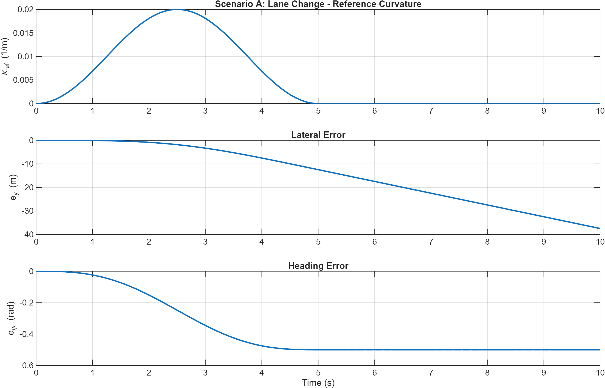

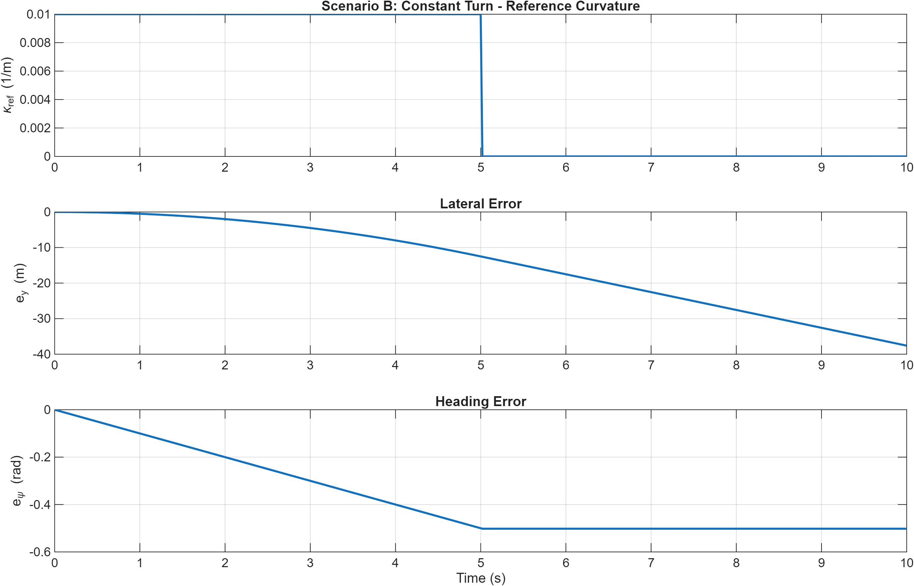

### Step 3: Baseline LQR closed-loop tracking

- `plots/scenario_A_lane_change_LQR.png`: closed-loop lane-change tracking with steering command
- `plots/scenario_B_constant_turn_LQR.png`: closed-loop constant-turn tracking with steering command

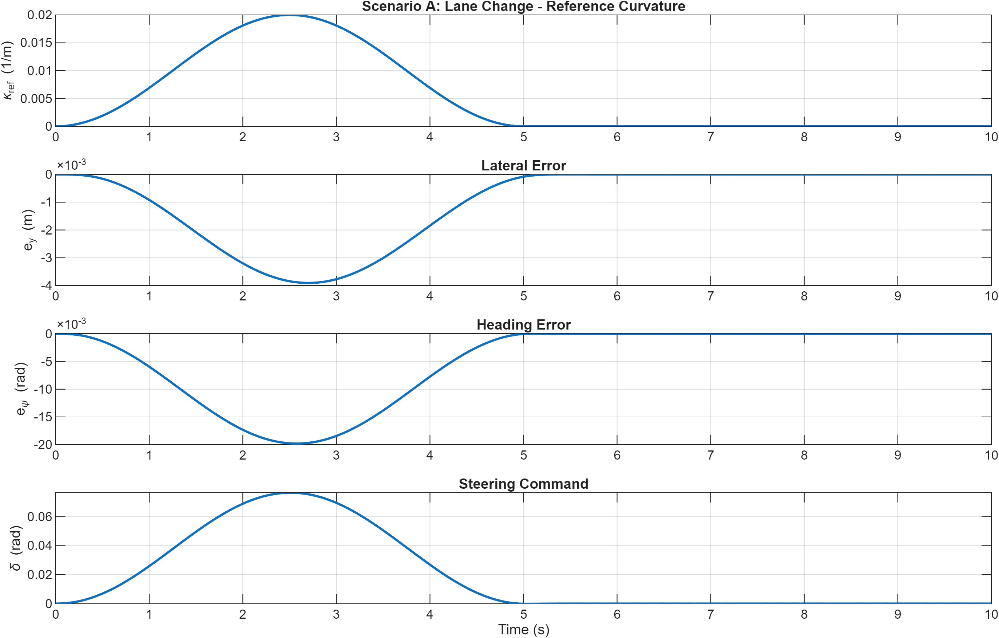

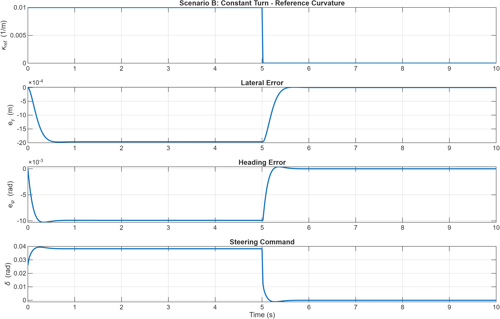

### Step 4: Actuator-constrained tracking

- `plots/scenario_A_lane_change_LQR_constraints.png`: lane-change comparison between unconstrained and constrained steering behavior
- `plots/scenario_B_constant_turn_LQR_constraints.png`: constant-turn comparison between unconstrained and constrained steering behavior

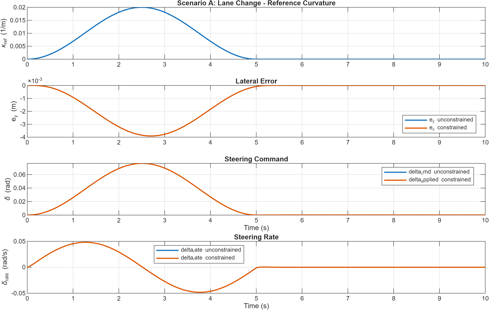

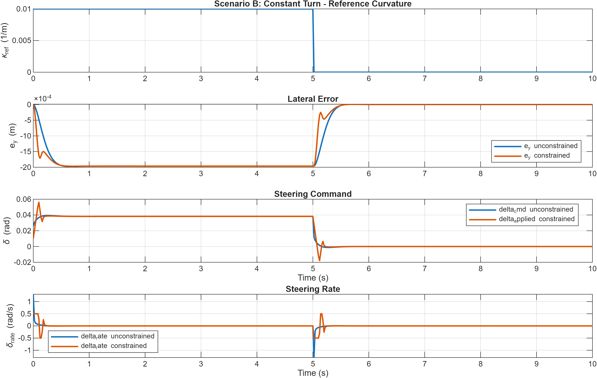

### Step 5A: Parameter-uncertainty study

- `plots/scenario_A_lane_change_uncertainty.png`: lane-change comparison between nominal and uncertain plant behavior
- `plots/scenario_B_constant_turn_uncertainty.png`: constant-turn comparison between nominal and uncertain plant behavior

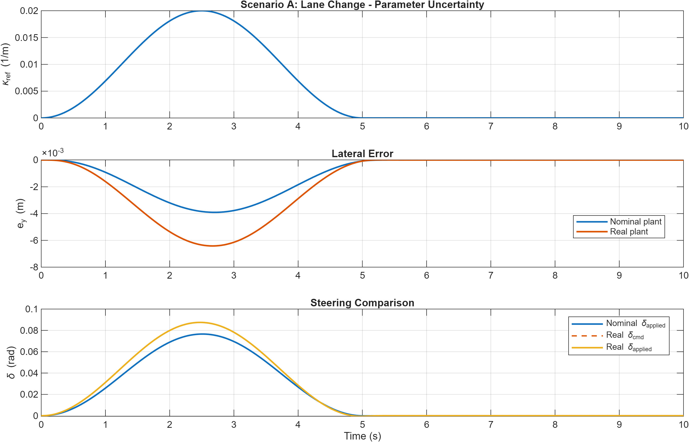

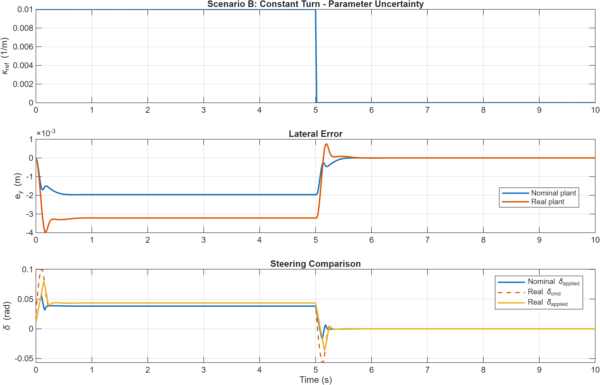

### Step 5B: Crosswind-disturbance study

- `plots/scenario_A_lane_change_wind.png`: lane-change response under a lateral wind-force pulse
- `plots/scenario_B_constant_turn_wind.png`: constant-turn response under a lateral wind-force pulse

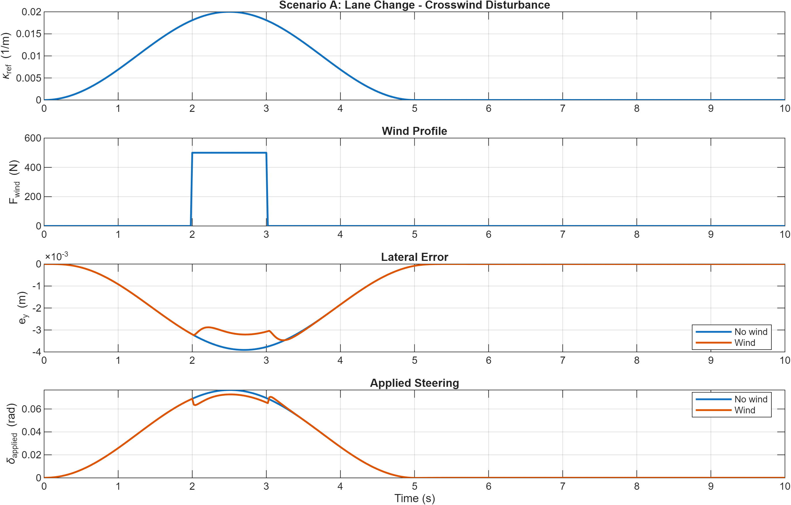

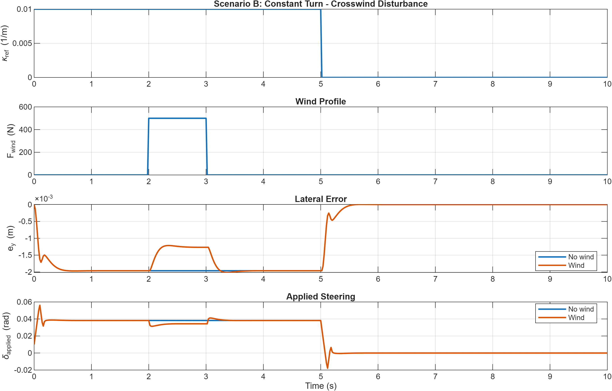

### Step 6: Novelty residual and rolling-bound plots

- `plots/scenario_B_what_overlay.png`: overlay of instantaneous residual norm `w_inf` for nominal, uncertainty, and wind cases
- `plots/scenario_B_wmax_overlay.png`: overlay of rolling disturbance bound `w_max` for nominal, uncertainty, and wind cases

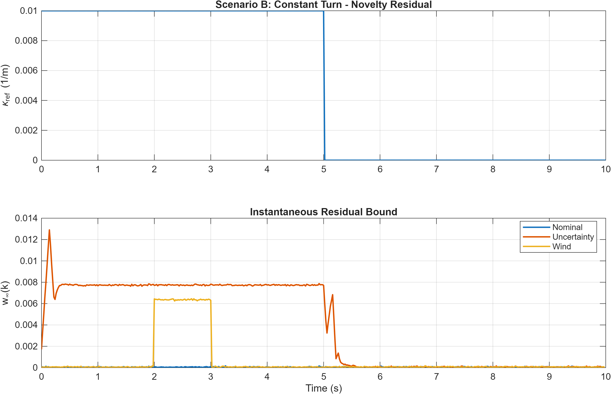

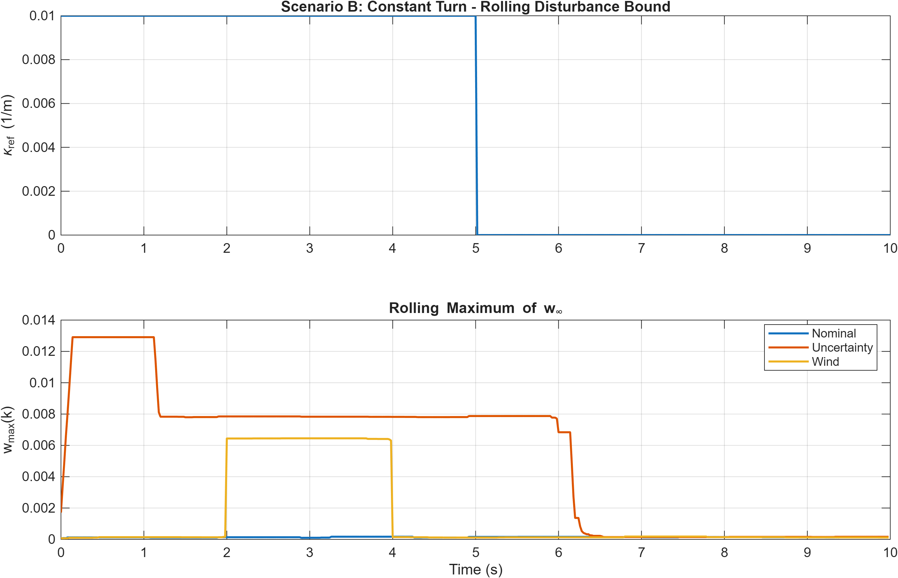

## How To Use

### MATLAB workflow

1. Open MATLAB in the project root.
2. Run `src/main_baseline.m`.
3. Review printed metrics in the Command Window.
4. Inspect the exported figures in `plots/` for the open-loop, LQR, constrained, uncertainty, wind, and novelty-estimation results.

### Simulink workflow

1. Open `src/egr560_tracking_sim.slx`.
2. Verify model parameters and scenario selection.
3. Run the simulation.
4. Compare the tracking, steering, and novelty signals against the MATLAB results.

## Notes

- The MATLAB script is currently the most explicit source of implementation details and numerical settings.
- The Simulink model is intended to mirror the same tracking logic rather than introduce a separate control design.
- Generated folders such as `slprj/` and cache files such as `.slxc` are normal Simulink artifacts.
- The README plot links assume the repository is viewed on GitHub or in a Markdown viewer that supports relative image paths.
